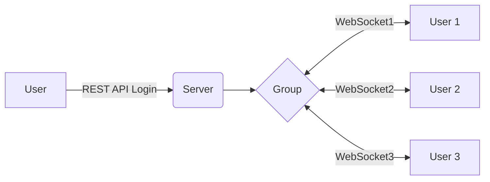
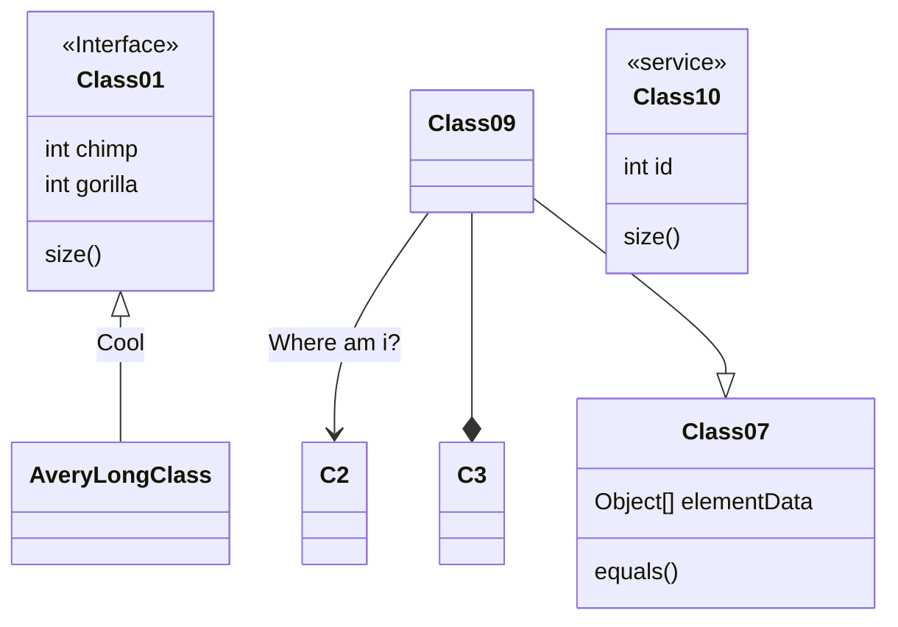
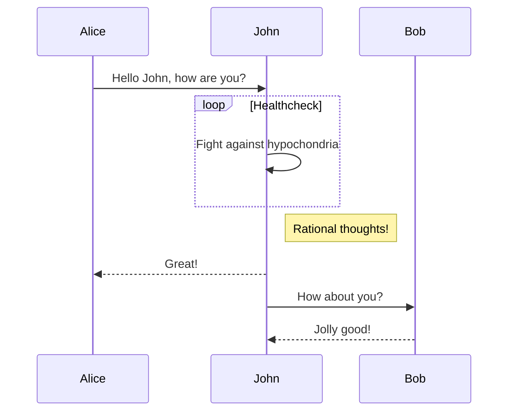

# class

## Component Diagram

```mermaid
flowchart LR

A[User] -->|REST API Login| B(Server)

B --> C{Group}
C <-->|WebSocket1| D[User 1]
C <-->|WebSocket2| E[User 2]
C <-->|WebSocket3| F[User 3]

```

 
## Class Diagram

```mermaid
classDiagram
Class01 <|-- AveryLongClass : Cool
<<Interface>> Class01
Class09 --> C2 : Where am i?
Class09 --* C3
Class09 --|> Class07
Class07 : equals()
Class07 : Object[] elementData
Class01 : size()
Class01 : int chimp
Class01 : int gorilla
class Class10 {
  <<service>>
  int id
  size()
}
```

## Sequence Diagram

```mermaid
sequenceDiagram
Alice->>John: Hello John, how are you?
loop Healthcheck
    John->>John: Fight against hypochondria
end
Note right of John: Rational thoughts!
John-->>Alice: Great!
John->>Bob: How about you?
Bob-->>John: Jolly good!
```